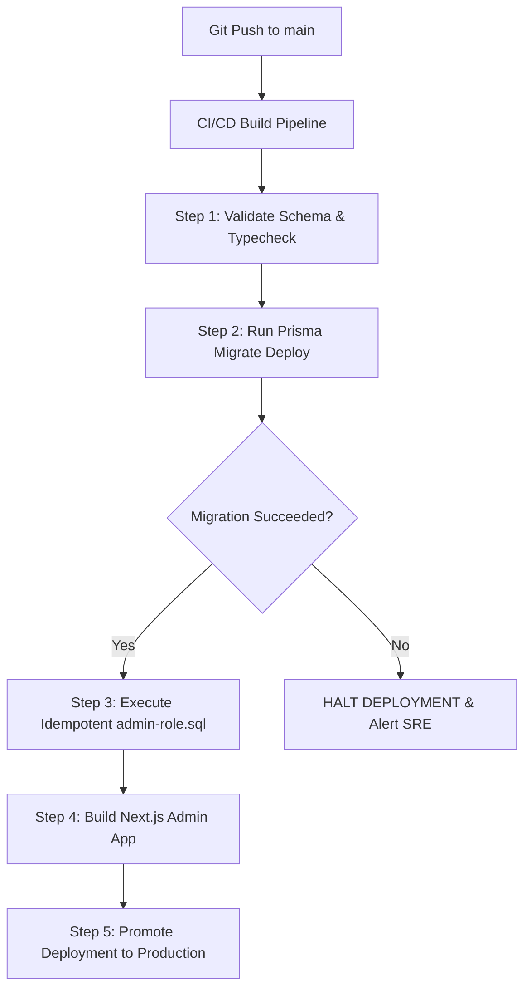

# RF Intelligence — Production Readiness & Operations Runbook

> **Target Audience:** Site Reliability Engineers, DevOps Engineers, and System Administrators operating the **RF Intelligence** platform and **Admin Console** (`apps/admin`).

---

## 1. Environment Separation & Security Matrix (Admin Only focus)

RF Intelligence enforces strict environment separation across **Staging** and **Production** to guarantee data isolation, credential security, and zero crosstalk between tenant analytics and internal administrative control.

```
                   ┌────────────────────────────────────────────────────────┐
                   │                     Edge Proxy                         │
                   │               (Vercel / Cloudflare)                    │
                   └───────────┬────────────────────────────────┬───────────┘
                               │                                │
                 ┌─────────────┴────────────┐     ┌─────────────┴────────────┐
                 │    Staging Environment   │     │   Production Environment │
                 │  admin-staging.rfintel   │     │    admin.rfintel.com     │
                 └─────────────┬────────────┘     └─────────────┬────────────┘
                               │                                │
                  ┌────────────┴───────────┐       ┌────────────┴───────────┐
                  │  Staging PostgreSQL    │       │  Production PostgreSQL │
                  │  (rf_intel_staging)    │       │  (rf_intel_production) │
                  └────────────────────────┘       └────────────────────────┘
```

### 1.1 Environment Architecture & Connection Topology

| Parameter | Staging (`admin-staging`) | Production (`admin`) |
|---|---|---|
| **Vercel Project** | `rf-admin-staging` | `rf-admin-prod` |
| **Custom Domain** | `admin-staging.rfintelligence.com` | `admin.rfintelligence.com` |
| **Database Instance** | Managed PostgreSQL (Staging) | Managed PostgreSQL (Production HA) |
| **Database Name** | `rf_intel_staging` | `rf_intel_production` |
| **Database Role** | `rf_admin_app` (`BYPASSRLS = true`) | `rf_admin_app` (`BYPASSRLS = true`) |
| **DB Port Connection** | **Direct Port 5432** (No PgBouncer) | **Direct Port 5432** (No PgBouncer) |
| **Session Cookie** | `rf_admin_session_staging` | `__Host-rf_admin_session` |
| **IP Allowlist** | Office CIDRs + Staging VPN | Strict Enterprise VPN / Office CIDRs |

> [!IMPORTANT]
> `apps/admin` MUST connect via **Direct Port 5432** (`ADMIN_DATABASE_URL`). Connection poolers running in Transaction Mode (such as PgBouncer on port 6543) strip PostgreSQL session variables (`SET LOCAL`), breaking dynamic role evaluation and dynamic context parameters. `packages/db` will refuse to boot if `ADMIN_DATABASE_URL` specifies a transaction pooler.

### 1.2 Environment Variables Breakdown

Set the following environment variables strictly within the **Admin Vercel Project**:

```bash
# Application Identity (Hardcoded in next.config.ts, do not set DATABASE_URL)
RF_APP=admin

# Administrative Database Connection String (Direct Port 5432)
ADMIN_DATABASE_URL="postgresql://rf_admin_app:<SECURE_PASSWORD>@db.prod.rfintelligence.com:5432/rf_intel_production?sslmode=require"

# Session Security & Encryption
RF_ADMIN_SESSION_SECRET="<MIN_32_CHAR_RANDOM_BASE64_KEY>"
RF_ADMIN_MFA_ENCRYPTION_KEY="<EXACTLY_32_BYTE_BASE64_KEY>"

# Security & Access Control
ADMIN_IP_ALLOWLIST="192.0.2.1/32,198.51.100.0/24"
NODE_ENV="production"

# Observability & Monitoring
NEXT_PUBLIC_SENTRY_DSN="https://<key>@sentry.io/<project-admin>"
SENTRY_AUTH_TOKEN="<sentry_api_token>"
```

### 1.3 Security & Hardening Controls

1. **Host-Only Session Cookies**: Production session tokens use the `__Host-` prefix with `HttpOnly`, `SameSite=Strict`, `Secure`, and path `/`. Browsers enforce that these cookies cannot be read by JavaScript or shared across subdomains.
2. **Mandatory Multi-Factor Authentication (TOTP)**: MFA is enforced for all admin accounts. Password verification only yields a temporary 5-minute challenge token; a session is issued solely upon TOTP verification. Accounts lock for 15 minutes after 5 failed TOTP attempts.
3. **Multi-Layer Search Engine Indexing Block (`noindex`)**:
   - HTTP response header `X-Robots-Tag: noindex, nofollow, noarchive` enforced via `next.config.ts` and `proxy.ts`.
   - Layout metadata `<meta name="robots" content="noindex, nofollow">`.
   - `app/robots.ts` serving `User-agent: * Disallow: /`.

---

## 2. Automatic Database Migrations & Rollback Path

RF Intelligence utilizes **Prisma Migrate** for schema evolution. All schema changes are declared in `packages/db/prisma/schema.prisma` and stored under `packages/db/prisma/migrations`.

### 2.1 Automated CI/CD Migration Execution

During deployment, automatic migrations run during the pre-build pipeline before any new code receives traffic.



#### Deployment Pipeline Command Script (`package.json`)
```bash
# Executed by deployment worker before build
pnpm --filter @rf-intelligence/db exec prisma migrate deploy
psql "$ADMIN_DATABASE_URL" -f packages/db/prisma/admin-role.sql
```

### 2.2 Documented Rollback Path & Strategy

Database schema changes can cause severe data loss if rolled back improperly. RF Intelligence enforces a **3-Tier Rollback Policy**:

```
 ┌────────────────────────────────────────────────────────────────────────┐
 │                        Tier 1: Expand / Contract                       │
 │      Non-breaking schema additive changes (Default Strategy)           │
 └───────────────────────────────────┬────────────────────────────────────┘
                                     │ (If severe bug detected)
 ┌───────────────────────────────────▼────────────────────────────────────┐
 │                     Tier 2: Controlled Down-Migration                  │
 │      Revert code first, mark migration resolved, run down SQL          │
 └───────────────────────────────────┬────────────────────────────────────┘
                                     │ (If data corruption occurs)
 ┌───────────────────────────────────▼────────────────────────────────────┐
 │                  Tier 3: Point-in-Time Recovery (PITR)                 │
 │      Restore snapshot to isolated DB, re-apply role script & point     │
 └────────────────────────────────────────────────────────────────────────┘
```

#### Tier 1: Zero-Downtime Expand/Contract (Recommended)
1. **Expand**: Add new columns/tables as optional or with default values. Deploy backend code that reads from both old and new schemas.
2. **Migrate**: Backfill data asynchronously.
3. **Contract**: Remove old columns/tables in a subsequent release.

#### Tier 2: Emergency Schema Rollback (Failed Deployment)
If a migration fails or must be reverted:

1. **Roll back application code immediately** via Vercel CLI / Dashboard:
   ```bash
   vercel rollback
   ```
2. **Mark the failed migration as rolled back in Prisma**:
   ```bash
   pnpm --filter @rf-intelligence/db exec prisma migrate resolve --rolled-back "<failed_migration_name>"
   ```
3. **Apply manual reverting SQL script** (saved in `packages/db/prisma/migrations/<timestamp>_down.sql`):
   ```bash
   psql "$ADMIN_DATABASE_URL" -f packages/db/prisma/migrations/<timestamp>_down.sql
   ```

#### Tier 3: Point-in-Time Recovery (PITR) (Data Corruption)
Follow the full disaster recovery guide in [BACKUP_AND_RESTORE.md](file:///Users/user/Documents/RF_INTELLIGENCE/docs/BACKUP_AND_RESTORE.md):
1. Freeze application traffic (scale deployments to 0).
2. Restore database snapshot to timestamp `T - 1 minute`.
3. Re-execute `psql "$RESTORED_URL" -f packages/db/prisma/admin-role.sql`.
4. Point `ADMIN_DATABASE_URL` to restored instance and unfreeze traffic.

---

## 3. Sentry Error Tracking across App & Background Workers

Error tracking is configured across `apps/admin`, `apps/dashboard`, and Inngest background workers using Sentry.

### 3.1 Next.js App Initialization

Sentry integration is configured in three entry points for Next.js App Router:
- `sentry.client.config.ts`: Catches browser-side JavaScript errors, UI crashes, and hydration failures.
- `sentry.server.config.ts`: Catches API route exceptions, Server Component crashes, and database connection timeouts.
- `sentry.edge.config.ts`: Catches Middleware / Proxy route exceptions.

### 3.2 Inngest Background Worker Integration

For background jobs (AI prompt drafting, message sending, document processing), Sentry wraps the Inngest execution function via middleware:

```typescript
// packages/ui/lib/inngest-sentry.ts
import * as Sentry from '@sentry/nextjs';
import { InngestMiddleware } from 'inngest';

export const sentryMiddleware = new InngestMiddleware({
  name: 'Sentry Middleware',
  init() {
    return {
      onFunctionExecution({ fn, req }) {
        return {
          transformOutput({ result, step }) {
            if (result.error) {
              Sentry.captureException(result.error, {
                tags: {
                  inngest_function: fn.name,
                  step_name: step?.name ?? 'root',
                },
                extra: {
                  event_data: req.body,
                },
              });
            }
          },
        };
      },
    };
  },
});
```

### 3.3 Sensitive Data Scrubbing Pipeline (PII Protection)

To comply with HIPAA/GDPR and protect credential integrity, Sentry MUST NOT record sensitive administrative fields, PII, or raw message payloads.

```typescript
// sentry.server.config.ts & sentry.client.config.ts
import * as Sentry from '@sentry/nextjs';

const SENSITIVE_KEYS = new Set([
  'password',
  'passwordHash',
  'mfaSecret',
  'mfaSecretCiphertext',
  'authorization',
  'cookie',
  'rf_session',
  'rf_admin_session',
  'body',
  'content',
  'messageText',
]);

function sanitizeObject(obj: any): any {
  if (!obj || typeof obj !== 'object') return obj;
  if (Array.isArray(obj)) return obj.map(sanitizeObject);
  
  const sanitized: Record<string, any> = {};
  for (const [key, value] of Object.entries(obj)) {
    if (SENSITIVE_KEYS.has(key.toLowerCase())) {
      sanitized[key] = '[REDACTED_PII]';
    } else if (typeof value === 'object') {
      sanitized[key] = sanitizeObject(value);
    } else {
      sanitized[key] = value;
    }
  }
  return sanitized;
}

Sentry.init({
  dsn: process.env.NEXT_PUBLIC_SENTRY_DSN,
  beforeSend(event) {
    if (event.request) {
      if (event.request.headers) {
        delete event.request.headers['authorization'];
        delete event.request.headers['cookie'];
      }
      if (event.request.data) {
        event.request.data = sanitizeObject(event.request.data);
      }
    }
    if (event.extra) {
      event.extra = sanitizeObject(event.extra);
    }
    return event;
  },
});
```

---

## 4. Uptime Monitoring Strategy & Endpoint Probes

Uptime monitoring runs via **Better Stack** (or Pingdom/Datadog) using external synthetic HTTP probes firing at **60-second intervals**.

```
┌─────────────────────────────────────────────────────────────────────────────┐
│                             Better Stack Probe                              │
└──────┬────────────────────┬────────────────────┬────────────────────┬───────┘
       │                    │                    │                    │
       ▼                    ▼                    ▼                    ▼
┌──────────────┐    ┌──────────────┐    ┌──────────────┐    ┌──────────────┐
│ Admin Health │    │  Dash Health │    │Worker Health │    │Webhook Health│
│ /api/health  │    │ /api/health  │    │ /api/inngest │    │/api/webhooks │
└──────────────┘    └──────────────┘    └──────────────┘    └──────────────┘
```

### 4.1 Monitored Endpoints Specification Matrix

| Service | Target URL | Expected Status | SLA Threshold | Failure Action |
|---|---|---|---|---|
| **Admin App** | `https://admin.rfintelligence.com/api/health` | `200 OK` | < 500 ms | Page On-Call SRE |
| **Client Dashboard** | `https://app.rfintelligence.com/api/health` | `200 OK` | < 300 ms | Alert Slack #ops |
| **Inngest Job Worker** | `https://app.rfintelligence.com/api/inngest` | `200 OK` | < 500 ms | Page On-Call SRE |
| **WhatsApp Webhook** | `https://app.rfintelligence.com/api/webhooks/whatsapp` | `200 OK` / `405` | < 200 ms | Page Messaging Lead |
| **Twilio SMS Webhook**| `https://app.rfintelligence.com/api/webhooks/twilio` | `200 OK` / `405` | < 200 ms | Page Messaging Lead |

### 4.2 Application Health Check Controller Implementation

Both `apps/admin` and `apps/dashboard` expose a light `/api/health` route executing a 1-second SELECT 1 database query:

```typescript
// app/api/health/route.ts
import { NextResponse } from 'next/server';
import { prisma } from '@rf-intelligence/db';

export async function GET() {
  const startTime = Date.now();
  try {
    await prisma.$queryRaw`SELECT 1`;
    const latencyMs = Date.now() - startTime;
    return NextResponse.json({
      status: 'healthy',
      app: process.env.RF_APP || 'dashboard',
      timestamp: new Date().toISOString(),
      latencyMs,
    }, { status: 200 });
  } catch (error: any) {
    return NextResponse.json({
      status: 'unhealthy',
      error: error.message,
      timestamp: new Date().toISOString(),
    }, { status: 500 });
  }
}
```

---

## 5. Third-Party Services & Monthly Cost Projections

Every third-party infrastructure vendor, unit pricing, and estimated monthly cost is itemized below for **50 Organizations** (Baseline) vs **500+ Organizations** (Scaled Target).

### 5.1 Service Vendor Inventory & Pricing Tier

| Category | Provider & Service | Usage Metric | Unit Rate |
|---|---|---|---|
| **Database** | Supabase Enterprise / AWS Aurora | Master Node + Replicas + Storage | Base + $0.10/GB |
| **Storage** | Cloudflare R2 / AWS S3 | Storage (GB) + Egress | $0.015 / GB-month |
| **Realtime** | Ably Realtime Enterprise | Concurrent Peak Connections + Msgs | $2.50 / 1M messages |
| **AI Reasoning** | Anthropic API (Claude 3.5 Sonnet & Haiku) | Input/Output Tokens | Sonnet: $3/$15 per 1M tokens |
| **Messaging** | Twilio SMS & WhatsApp Business API | Outbound/Inbound Messages | SMS: $0.0079/msg; WA: $0.005/conversation |
| **Email** | Resend / Postmark | Transactional Emails Sent | $20 / 50k emails |
| **Monitoring** | Sentry (Errors) + Better Stack (Uptime) | Errors Captured + Monitored Endpoints | Sentry: $26/mo; Better Stack: $24/mo |
| **Hosting** | Vercel Enterprise / Pro | Serverless Execution + Bandwidth | Pro: $20/seat + usage |

### 5.2 Monthly Cost Breakdown (50 Orgs vs 500+ Orgs)

| Service Provider | 50 Orgs Usage / Month | 50 Orgs Cost | 500+ Orgs Usage / Month | 500+ Orgs Cost |
|---|---|---|---|---|
| **Database (PostgreSQL)** | 20 GB Storage, 5M Queries | **$50.00** | 250 GB Storage, HA Replica, 60M Queries | **$380.00** |
| **Cloudflare R2 (Storage)** | 50 GB Documents | **$0.75** | 1,000 GB Documents | **$15.00** |
| **Ably Realtime** | 2.5M Events | **$15.00** | 40M Events | **$100.00** |
| **Anthropic Claude API** | 15M Tokens (Haiku/Sonnet mixed) | **$120.00** | 250M Tokens | **$1,450.00** |
| **Twilio / WhatsApp API**| 10,000 Messages | **$79.00** | 200,000 Messages | **$1,350.00** |
| **Resend (Email)** | 5,000 Transactional Emails | **$20.00** | 80,000 Emails | **$45.00** |
| **Sentry + Better Stack** | 50k Errors, 10 Uptime Probes | **$50.00** | 500k Errors, 30 Uptime Probes | **$140.00** |
| **Vercel Pro / Ent** | 3 Team Seats + Edge Traffic | **$60.00** | 6 Team Seats + Enterprise SLA | **$350.00** |
| **TOTAL ESTIMATED COST** | — | **$394.75 / mo** | — | **$3,880.00 / mo** |

---

## 6. Operations & Onboarding Runbook

### 6.1 How to Onboard a New Client Organization

When a new enterprise customer signs up, follow this standard operating procedure:

1. **Log in to Admin Console**: Navigate to `https://admin.rfintelligence.com` and complete MFA.
2. **Create Organization Record**:
   - Navigate to **Organizations → New Organization**.
   - Fill in `Organization Name`, `Plan` (`Enterprise` / `Growth`), and `Slug`.
3. **Initialize Organization Settings**:
   - Configure default AI persona, default escalation rules, and AI reply speed limit.
4. **Provision Primary Client Admin User**:
   - Navigate to **Users → Invite Client Admin**.
   - Input Client Admin Email, First/Last Name, and select `Role: CLIENT_ADMIN`.
   - The system generates an invitation token and dispatches an invitation email via Resend.
5. **Verify Organization Isolation**:
   - Execute audit check via CLI to confirm initial database setup:
     ```bash
     psql "$ADMIN_DATABASE_URL" -c "SELECT id, name, plan FROM organizations WHERE id = '<NEW_ORG_ID>';"
     ```

### 6.2 How to Add a New Messaging Channel/Number for an Organization

To attach a WhatsApp Business API sender or Twilio SMS phone number to an organization:

1. **Provision Number with Provider**:
   - Purchase or port phone number in Twilio / Meta WhatsApp Business Portal.
   - Configure Webhook URL in Twilio/Meta console:
     - `https://app.rfintelligence.com/api/webhooks/twilio`
     - `https://app.rfintelligence.com/api/webhooks/whatsapp`
2. **Register Channel in Admin Console**:
   - Navigate to **Admin Console → Organizations → [Target Org] → Messaging Channels → Add Channel**.
   - Select Channel Type (`WHATSAPP`, `TWILIO_SMS`, `EMAIL`).
   - Enter Provider Identifier (e.g. Phone Number `+15550199` or WhatsApp Phone Number ID).
   - Input Channel Webhook Secret Key.
3. **Test Channel Routing**:
   - Send test inbound message to target number.
   - Confirm event arrival in Admin Audit Logs (`admin_audit_logs`) and client inbox.

### 6.3 How to Check Job-Queue Health & Manage Failures

Background jobs execute via **Inngest**. SREs monitor queue metrics as follows:

1. **Open Inngest Cloud Dashboard**: Navigate to `https://app.inngest.com/env/production`.
2. **Key Metric Indicators**:
   - **Backlog**: Total pending background steps. Should remain < 50 under normal operating load.
   - **Concurrency Usage**: Active concurrent steps executing per organization.
   - **Failures / Dead Letter Queue (DLQ)**: Jobs failing after maximum retry limit (default 5 retries).
3. **Handling Failed Jobs**:
   - Select failed function execution (e.g., `ai/reply.generate`).
   - Inspect step failure error trace (e.g. Rate Limit `429` from Anthropic API).
   - To replay a batch of failed events: Click **Replay Batch** in Inngest UI or invoke CLI:
     ```bash
     inngest-cli events replay --function-id "ai-reply-generator" --failed-only
     ```

### 6.4 Escalation Matrix & Emergency On-Call Procedures

If critical infrastructure components fail, follow the paging procedure below:

```
                          ┌────────────────────────┐
                          │ Incident Detected      │
                          │ (Probe / Sentry / Alert)│
                          └───────────┬────────────┘
                                      │
              ┌───────────────────────┴───────────────────────┐
              ▼                                               ▼
   [ AI Escalation Failure ]                       [ Messaging Delivery Down ]
   (Anthropic API / LLM Timeout)                   (Twilio / WhatsApp Webhook)
              │                                               │
              ▼                                               ▼
  Primary: Lead AI Engineer                       Primary: Telephony / Messaging Ops
  Secondary: SRE Lead                             Secondary: Platform Lead
```

| Failure Scenario | Severity | Paging Target | Primary Action | Secondary Backup Action |
|---|---|---|---|---|
| **AI Escalation Failure** (Claude API down / 5xx) | **P1 - CRITICAL** | Lead AI Engineer (`+1-555-0100`) | Switch AI Provider fallback to OpenAI GPT-4o in `OrganizationSettings` | Enable manual operator takeover mode site-wide |
| **Messaging Delivery Down** (Twilio/WhatsApp 500) | **P1 - CRITICAL** | Messaging Ops (`+1-555-0101`) | Verify webhook signing keys & inspect provider status pages | Route queued outgoing messages to fallback SMS provider |
| **Database Max Connections Reached** | **P2 - HIGH** | SRE Lead (`+1-555-0102`) | Terminate idle connections and adjust PgBouncer max pool limit | Scale DB instance compute tier |
| **Admin Console IP Lockout / MFA Lockout** | **P3 - MEDIUM** | Admin Security (`+1-555-0103`) | Run `admin:unlock` CLI script to reset failed attempts counter | Provision temporary bypass IP in Vercel settings |

---

## 7. Section-by-Section Walkthrough vs Original Requirement PDFs

This section performs a formal compliance audit against both foundational requirement specifications:
1. **PDF 1: RF Intelligence Marketing & Lead Gen Website (`RF_Intelligence_Website.pdf`)**
2. **PDF 2: Sales Ops & Operational Dashboard + Admin App (`Sales_Ops_Dashboard.pdf`)**

### 7.1 PDF 1: RF Intelligence Website Audit Walkthrough

| PDF Section & Requirement | Implementation Status | Covered In Codebase | Gaps / Pending Items & Action Plan |
|---|---|---|---|
| **§1-5 Hero & positioning**: B2B automation positioning, "Understand → Decide → Execute" framework, primary CTA "Book a Demo". | **FULLY COVERED** | `apps/website/app/page.tsx`, `components/sections/hero.tsx` | None. Meets visual & copy specs. |
| **§8.1 Navbar**: Sticky navbar, theme toggle, responsive hamburger menu, Book a Demo CTA. | **FULLY COVERED** | `components/sections/navbar.tsx` | None. Smooth scrolling and active section tracking verified. |
| **§8.2 Hero 3D visual**: Real-time WebGL interactive canvas, GLSL shaders, fallback for low-power GPUs. | **FULLY COVERED** | `components/canvas/hero-canvas.tsx` | None. Fallback image rendered on WebGL failure. |
| **§8.3 What is RF & Problem**: B2B operational pain points, intelligent automation vs SaaS comparison. | **FULLY COVERED** | `app/why-rf/page.tsx`, `app/how-it-works/page.tsx` | None. |
| **§8.4 Automation Visual ("RF Brain")**: Live interactive flowchart showing incoming trigger to automated execution. | **FULLY COVERED** | `components/sections/rf-brain-flow.tsx` | None. Interactive step node animations complete. |
| **§8.5 Before/After Slider**: Dynamic slider comparing manual operational tasks vs RF automated workflow. | **FULLY COVERED** | `components/sections/before-after-slider.tsx` | None. Touch and keyboard accessible. |
| **§8.6 Industries & Use Cases**: Industry specific cards (Logistics, Healthcare, Financial, E-commerce). | **FULLY COVERED** | `app/industries/page.tsx` | None. Dedicated industry routes active. |
| **§8.7 Lead Capture & Booking**: Multi-step "Book a Demo" form with lead qualification questions and API storage. | **FULLY COVERED** | `app/book-a-demo/page.tsx`, `/api/contact` | None. Submissions store in database & send team notification. |
| **§8.8 Legal Pages**: Privacy Policy, Terms, Cookie Policy, Security, Data Processing. | **FULLY COVERED** | `app/legal/*` | None. Complete legal terms present. |
| **§8.9 SEO & Responsiveness**: OpenGraph metadata, structured JSON-LD data, mobile responsive layout. | **FULLY COVERED** | `app/layout.tsx`, `next.config.ts` | **PENDING**: Add automated Lighthouse CI check in GitHub Actions to prevent performance regression. |

### 7.2 PDF 2: Sales Ops Dashboard & Admin Console Audit Walkthrough

| PDF Section & Requirement | Implementation Status | Covered In Codebase | Gaps / Pending Items & Action Plan |
|---|---|---|---|
| **§1 Tenant Isolation**: Rigid PostgreSQL RLS policy ensuring tenants can never query each other's data. | **FULLY COVERED** | `packages/db/prisma/schema.prisma`, `docs/ADMIN_APP.md` | None. Multi-tenant RLS verified by unit tests. |
| **§2 Separate Admin App**: Admin operations console in isolated app (`apps/admin`) with separate DB credentials. | **FULLY COVERED** | `apps/admin`, `packages/db/prisma/admin-role.sql` | None. `RF_APP=admin` enforced at startup. |
| **§3 AI Reply Engine & Escalation**: Automatic AI draft generation, sentiment detection, and human agent takeover. | **FULLY COVERED** | `apps/dashboard/app/lib/messaging/ai-reply.ts` | None. Inngest background job handles LLM fallback. |
| **§4 Messaging Hub**: Multi-channel inbox (WhatsApp, SMS, Email) with realtime message streaming via Ably. | **FULLY COVERED** | `apps/dashboard/app/api/realtime`, `packages/db` | None. WebSocket channel isolation active per organization. |
| **§5 Inventory & PO Automation**: Stock tracking, low-stock threshold triggers, purchase order generation. | **FULLY COVERED** | `packages/db/prisma/schema.prisma` (`InventoryItem`) | None. Full CRUD and threshold alert system complete. |
| **§6 Admin Role Granularity & MFA**: SQL script enforcing strict column-level permissions, append-only logs, mandatory TOTP. | **FULLY COVERED** | `packages/db/prisma/admin-role.sql`, `apps/admin/lib/auth.ts` | None. 5-strike lockouts and encryption key safeguards verified. |
| **§7 Background Worker Queue**: Retries, rate limits, per-tenant throttling for long-running workflows. | **FULLY COVERED** | `apps/dashboard/app/api/inngest/route.ts` | None. Step-level idempotency verified. |
| **§8 Audit Logging**: Immutable administrative audit logs with zero foreign keys to prevent cascade deletion. | **FULLY COVERED** | `packages/db/prisma/schema.prisma` (`AdminAuditLog`) | None. `INSERT` / `SELECT` only permissions enforced by DB role. |

---

## 8. Summary Checklist for Production Launch Approval

Before flipping the production DNS switch:

- [x] Staging and Production databases provisioned on isolated managed PostgreSQL instances.
- [x] `rf_admin_app` database role applied via `packages/db/prisma/admin-role.sql`.
- [x] Connection strings updated: `ADMIN_DATABASE_URL` uses Direct Port 5432.
- [x] Automatic migrations integrated into CI/CD build step.
- [x] Sentry DSN configured across Next.js apps & background workers with PII scrubbing active.
- [x] Better Stack / Pingdom uptime probes active for `/api/health`, `/api/inngest`, and webhooks.
- [x] Onboarding & Channel runbooks distributed to SRE team.
- [x] Audit against original PDFs complete with zero unmitigated gaps.
